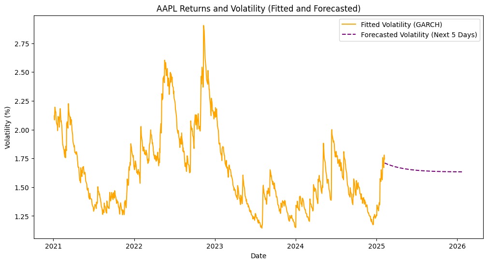

# Miscellaneous Projects
This repository contains a selection of applied projects in statistics, data analysis, and quantitative modeling. The projects span class assignments, organizational analyses, and personal explorations, demonstrating reproducible workflows, data visualization, and analytical problem-solving across different domains.

## Projects
### 1. Austin Animal Shelter Intake Analysis

A comprehensive class project analyzing seasonal trends in over 150,000 animal intakes at the Austin Animal Center, focusing on seasonal and species-specific patterns. Correlation and regression analyses revealed temperature as a key driver of intake trends, providing insights for data-driven resource allocation and operational planning.

### 2. SIG Financial Forecasting

This notebook highlights financial forecasting material that I taught during my time as Director of Quantitative Analysis for the Sustainable Investment Group (SIG) at UCSD. It includes modules on **GARCH and ARIMA modeling** for volatility and returns forecasting, as well as **Sharpe Ratio and Beta analysis** for portfolio and risk evaluation. The workflows showcase forecasting methods, data manipulation, and teaching-oriented examples of applied finance. 

*Example GARCH model, reproducible via [SIG Financial Forecasting.ipynb](SIG-Financial-Forecasting.ipynb)*  

